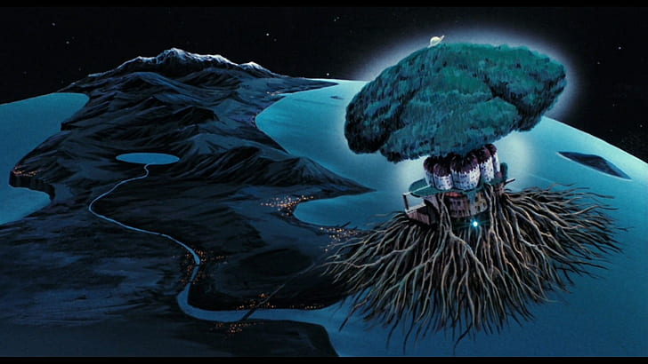

# Homework 4: L-systems

Nick Moon (moonmoon)

Live Demo: https://nicholasmoon.github.io/hw03-l-systems/

For my L-System Project, I decided to make Laputa from Castle in the Sky, the Studio Ghibli film. 

Courtesy Wallpaper Flare (https://www.wallpaperflare.com/laputa-castle-in-the-sky-wallpaper-tjkia)

I implemented an
L-System generation engine from near scratch in WebGL using the base code provided. I then used this engine to develop
two seperate L-Systems, one for the upper half of the giant tree in the castle, and a second for the roots on the bottom.
I used cosine color palettes to get the color of the branches based on the distance traveled along the turtle path.
I also used the icosphere from previous HW assignments as a fruit on the tree, whose color is also cosine palette based.
I used a random number and probability to choose whether to create a fruit or not.
I also used SDFs to model the architectural base of the castle crudely.

I also had to generate the earth seen in the background. I used a sphere SDF and fbm for the terrain height generation,
and changed color based on the height offset. To get the lights twinkling in the cities, I used worley noise
and certain specific noise value and height range checks to create bright orange pixels on the surface of the earth
(appearing mostly near sources of water). The star field in the background was worley noise based.

My GUI has inputs for parameters like number of iterations, step size, angle, and even the grammars themselves. It is an extensible framework.

My final L-Systems turned out to be:\
Tree:\
Premise: A\
Rule 1: A=>B[+BAB][-BAB][&BAB][\^BAB][+&BAB][-&BAB][+\^BAB][-\^BAB]{1.0}\
Rule 2: B=AEAE{1.0}\
Rule 3: E=*{0.125}|F{0.875}

Roots:\
Premise: !FFFFFFF--&^^&&A\
Rule 1: A=>\^FF-[+FFFB]&[-FFFB]+[&FFFB]-[\^FFFB]{1.0}\
Rule 2: B=+X-XX^FF-A&FFB{1.0}\
Rule 3: X=+F{0.5}|++&FA{0.5}

My command list was as follows:\
F: Move forward by step size in current direction\
\[: Push current turtle\
\]: Pop current turtle\
\<: Increase scale\
\>: Decrease scale\
\*: Create a fruit\
\+: Rotate Z +\
\-: Rotate Z -\
\!: Rotate Z 180 degrees\
\&: Rotate X +\
\^: Rotate X -\
\#: Rotate X 180 degrees\
\/: Rotate Y +\
\\: Rotate Y -\
\$: Rotate Y 180 degrees\

My engine also allows users to specify multiple postconditions for a rule, with the probability XXX of choosing that
rule specified with {XXX}.

Creating the L-System engine in WebGL definitely took the most time in this project, 
but it was a very useful opportunity to
implement one to really understand the underlying mechanisms at play in a program like Houdini.
Overall I was satisfied with my background and the L-System engine, although my actual castle and tree could have used a lot
more polish.

Helpful references:
https://iquilezles.org/articles/distfunctions/

https://iquilezles.org/articles/palettes/

https://www.sidefx.com/docs/houdini/nodes/sop/lsystem.html

http://dev.thi.ng/gradients/

http://paulbourke.net/fractals/lsys/
